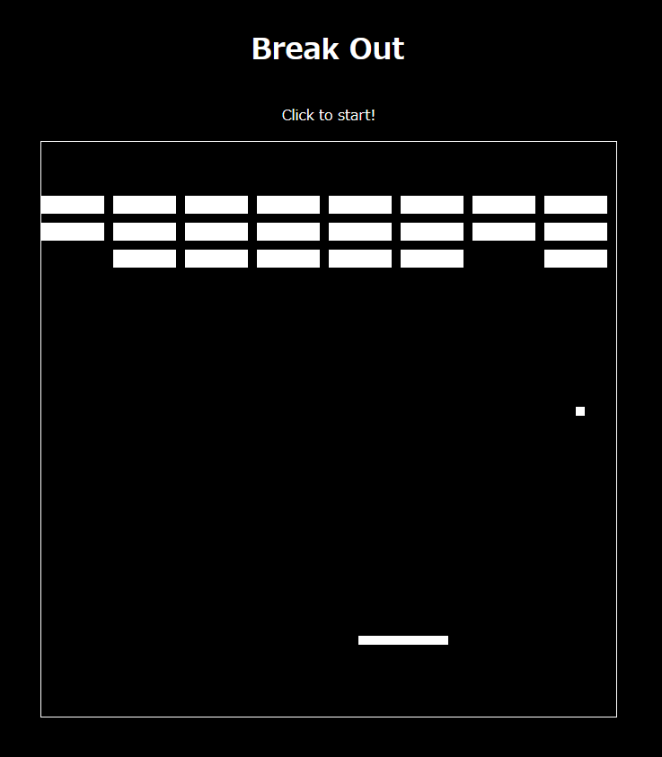

# gpt-breakout
JS BreakeOut Game by ChatGPT and Me

## 解説

This time, I use GPT-4 by ChatGPT

- [完成したゲーム](https://ycatch.github.io/gpt-breakout/)
- [GPT-4で、JSブロックくずしをステップバイステップで作ってみた - Qiita](https://qiita.com/y_catch/items/fd4268af8e4e8976547f)

## LICENSE

MIT License

Copyright (c) 2023 Yutaka Catch

いちおうライセンスを設定しておく。

ただ、ジェネレーティブAIに著作権は発生しないという話もある。
